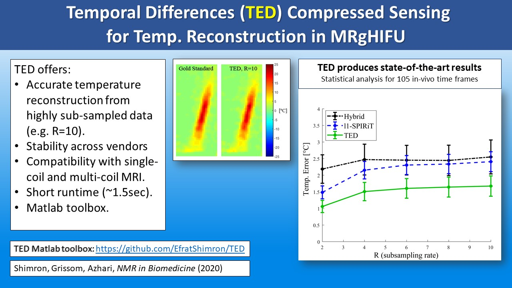
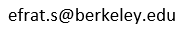

----------------------------------------------------------------------------------------
# TED toolbox

-----------------------------------------------------------------------------------------
##### TED: Temporal Differences (TED) Compressed Sensing

##### TED is a Compressed Sensing method for temperature reconstrcution from sub-sampled dynamic MRI data.

Paper: https://onlinelibrary.wiley.com/doi/abs/10.1002/nbm.4352

Summary slide:

 ============================================

### What this code does:
This Matlab toolbox contains an implementation of the TED  algorithm [1] and demos with two datasets:
1. Gel phantom data (GE scanner).
2. Agar phantom data (Philips scanner).

In both cases, fully sampled data was acquired in-vitro and then retrospectively subsampled offline. A reference (gold standard) temperature map was computed from the fully-sampled dataset, and the TED reconstruction was computed from sub-sampled data.

TED is compared with two well-established methods: *l*1-SPIRiT [2] and the K-space Hybrid Method [3].

## Generalizability
While we proposed TED for temperature reconstruction, TED is in fact a *general* dynamic MRI method. It can hence be implemented to other dynamic MRI applications, such as cardiac MRI. If you find a cool implementation - let us know!

### Prerequisites
Matlab is required. The code was tested with Matlab2017R.

## Getting Started
Clone or download the code.

## Running the examples
Open the demo_start.m function in Matlab, choose one example from the following list, set the desired
reduction factor (R), and run the code.

## Demo 1 - gel phantom - expected output:

## Demo 2 - agar phantom - expected output:

### Acknowledgments

The TED toolbox was built upon the *l*1-SPIRiT toolbox that was created by Prof. Michael (Miki) Lustig and is available at his website:
http://people.eecs.berkeley.edu/~mlustig/Software.html

The agar phantom data and the code for the K-space Hybrid Method are courtesy of Prof. William Grissom, Vanderbilt University, TA, USA.

The gel phantom data is courtesy of INSIGHTEC Ltd.

### Contact
If you have any questions or if you found a cool app of TED and want to let us know, please contact me:
Efrat Shimron, 

You can also see my other projects here:
https://sites.google.com/view/efratshimron/home

### References
[1] Shimron E., Grissom W., Azhari H. (2020) "Temporal Differences (TED) Compressed Sensing: A Method for Fast MRgHIFU Temperature Imaging". *NMR in Biomedicine, in press*.

[2] Murphy M, et al. (2012) "Fast *l*₁-SPIRiT Compressed Sensing Parallel Imaging MRI: Scalable Parallel Implementation and Clinically Feasible Runtime". *IEEE TMI*.

[3] Gaur P, Grissom WA. (2015) Accelerated MRI thermometry by Direct Estimation of Temperature from Undersampled K-space Data. *MRM*.
