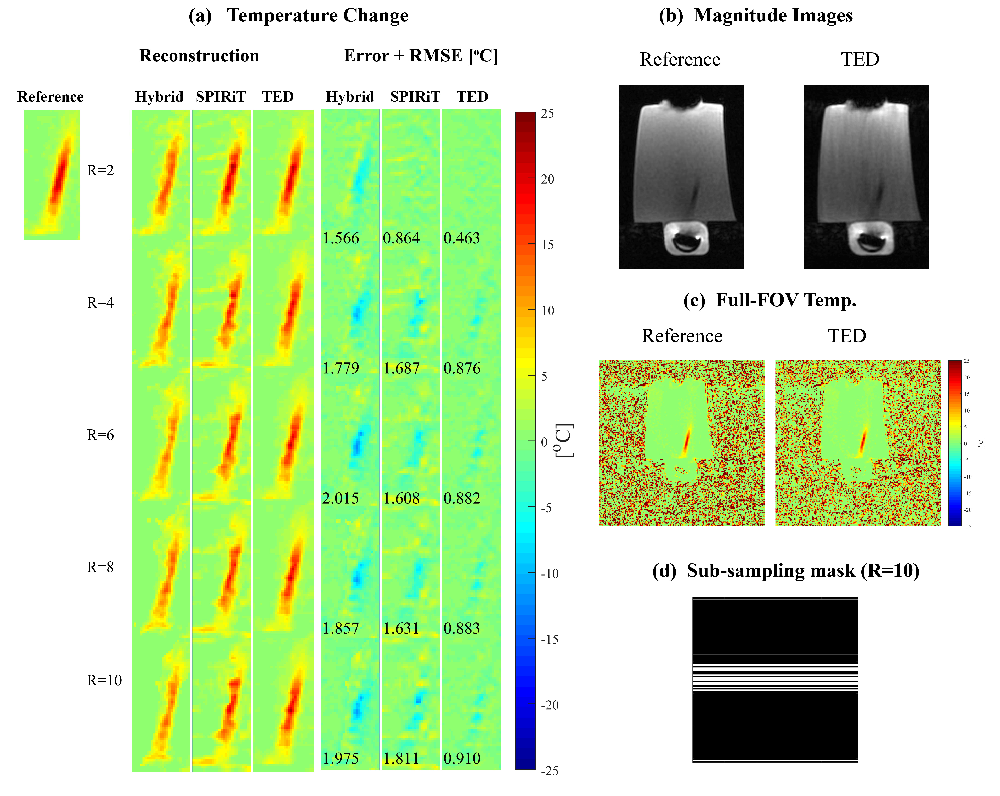
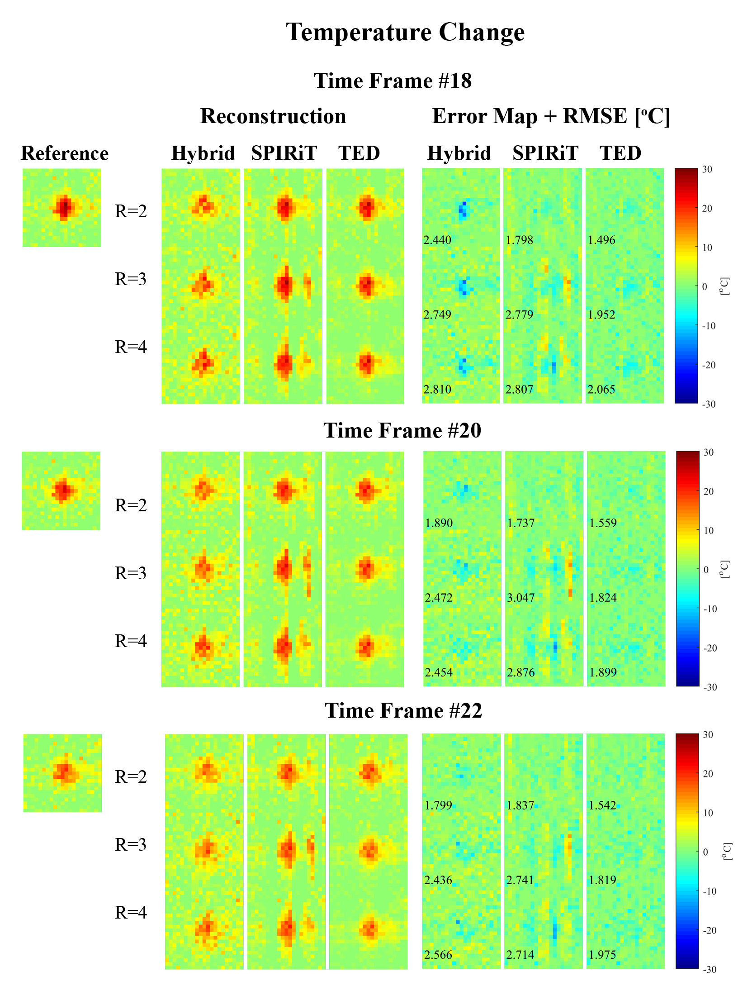

----------------------------------------------------------------------------------------
# A Matlab Toolbox for the Temporal Differences (TED) Compressed Sensing Method

Demonstration for Temperature monitoring in MR-guided-HIFU scans
-----------------------------------------------------------------------------------------
Temporal Differences (TED) Compressed Sensing is a general method for accelerating dynamic MRI scans. TED combines k-space subsampling, parallel imaging, and the proposed Compressed Sensing reconstruction framework. The method is described in a manuscript that was submitted to journal NMR in Biomedicine (2020).

In this toolbox, TED is demonstrated by implementation to data from MRI scans performed during High Intensity Focused Ultrasound (HIFU) treatments. However, TED is more general and can be applied to other k-t MRI data.

This Matlab toolbox contains the TED code and two temperature reconstruction demos:
1. Gel phantom data, acquiredw with a GE scanner.
2. Agar phantom data, acquired with a Philips scanner.

In both cases, fully sampled data was acquired in-vitro and then retrospectively subsampled offline using a practical 1D variable-density mask.

TED was compared with two well-established methods: *l*1-SPIRiT [1] and the K-space Hybrid Method [2].

## Getting Started
Clone or download the CORE-PI code.

## Running the examples
Open the "main.m" function in Matlab, choose one example from the following list, set the desired
reduction factor (R), and run the code.

## Gel phantom demo - GE scanner

## Agar phantom demo - Philips scanner

### Acknowledgments
The agar phantom data and the code for the K-space Hybrid Method are courtesy of Prof. William Grissom, Vanderbilt University, TA, USA.

The gel phantom data is courtesy of Insightec Ltd., Tirat HaCarmel, Israel.

The *l*1-SPIRiT code was reproduced from Michael Lustig's  toolbox (http://people.eecs.berkeley.edu/~mlustig/Software.html)

### Prerequisites
A liscence for Matlab is required. The code was tested with Matlab2017R.

### References
[1] Murphy M, et al. (2012) Fast l₁-SPIRiT compressed sensing parallel imaging MRI: scalable parallel implementation and clinically feasible runtime. IEEE TMI.

[2] Gaur P, Grissom WA. (2015) Accelerated MRI thermometry by direct estimation of temperature from undersampled k-space data. MRM.
